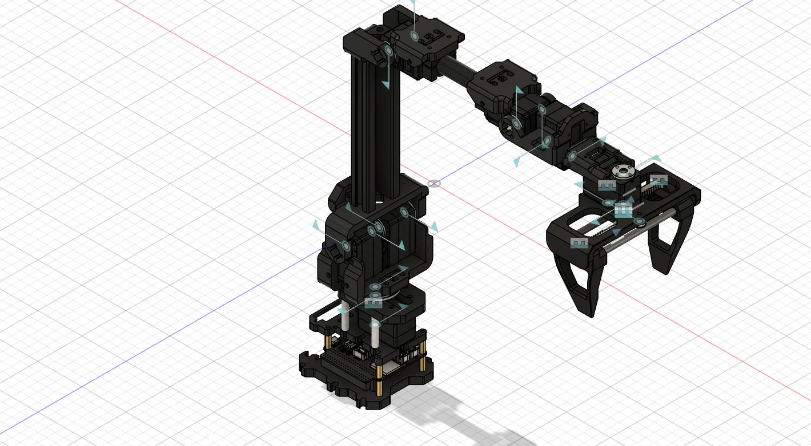

# dual-arm-cable-insertion-ros2
Vision-assisted dual-arm cable handover and insertion using ROS 2, MoveIt 2 and ArUco-based pose estimation.
# Vision-Assisted Dual-Arm Cable Handover and Insertion using ROS 2

A vision-assisted dual-arm robotic system for autonomous cable handover and connector insertion using ROS 2, MoveIt 2 and ArUco-based pose estimation.

## Project Status

**In Development**

## Overview

This project focuses on developing an autonomous dual-arm robotic system for cable handover and connector insertion.

The system is designed to detect the cable and connector using fiducial markers, coordinate two robotic arms, plan collision-free trajectories, perform an arm-to-arm cable handover, and execute precise insertion.

The robotic platform is based on a low-cost 7-DoF bio-inspired arm driven by ST3215 serial-bus servos.

## Key Objectives

- Develop an ArUco marker-based vision system for 3D pose estimation.
- Implement dual-arm coordination using ROS 2 and MoveIt 2.
- Plan collision-free trajectories in a shared workspace.
- Perform autonomous cable handover between two robotic arms.
- Perform peg-in-hole and cable insertion tasks.
- Evaluate positioning accuracy, handover reliability and execution performance.

## Technologies

- ROS 2
- MoveIt 2
- Python
- ArUco / Computer Vision
- RViz
- Gazebo
- URDF / Xacro
- Motion Planning
- Inverse Kinematics
- CAD
- Serial-Bus Servos

## Current Progress

### Completed / Developed

- Problem identification and system objectives
- Initial robotic arm design
- Redesigned robotic arm CAD model
- Mechanical integration planning
- URDF/Xacro development

### In Progress

- ROS 2 integration
- MoveIt 2 configuration
- Motion planning
- Dual-arm coordination

### Upcoming

- Vision integration
- Autonomous handover
- Cable insertion
- Testing and evaluation

## System Concept

The intended workflow is:

1. Detect the cable and connector using ArUco markers.
2. Estimate their 3D poses.
3. Plan the required robot motion using MoveIt 2.
4. Move the first arm to grasp and stabilize the cable.
5. Transfer the cable to the second arm.
6. Plan the insertion trajectory.
7. Perform the connector insertion while avoiding collisions.

## Project Documentation

- [Project Review Presentation](./docs/Dual_Arm_Cable_Insertion_Project_Review.pdf)
- [FANUC Project Portfolio](./docs/FANUC_Major_Project_Portfolio_Alen_George.pdf)

## Project Media

Selected CAD models and project images are available in the [`media`](./media/) folder.

## Future Scope

- Marker-free cable and connector detection using learned vision models.
- Cable shape estimation and tracking.
- Force and tactile sensing for compliant insertion.
- Learning-based handover and insertion.
- Extension to multi-cable wiring-harness assembly.
